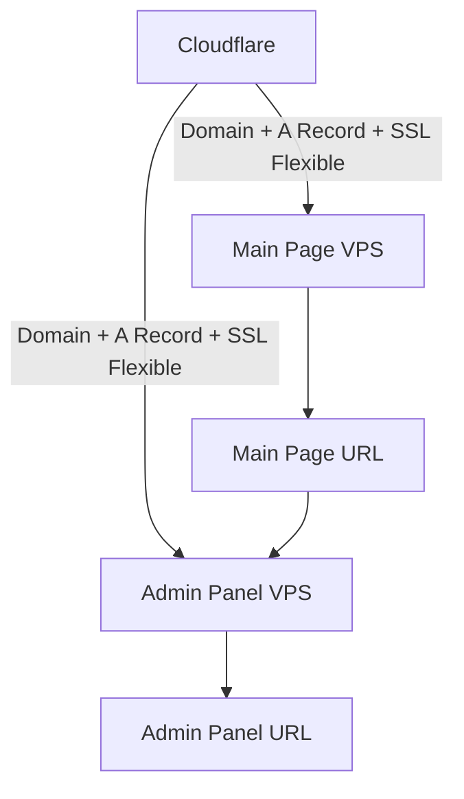

````markdown
# 🚀 Cephas Installation & Setup Guide

Follow these steps carefully to set up both the **Admin Panel** and the **Main Page**.

---

## 🌐 1. Domain & Cloudflare Setup

1. Login to your [Cloudflare](https://dash.cloudflare.com/) account.  
2. Add **two domains**:  
   - One for the **Admin Panel**  
   - One for the **Main Page**  
3. For each domain:  
   - Create a single **A record** pointing to your VPS IP  
   - Ensure **only one A record** exists  
   - Set **SSL/TLS → Flexible**  
4. Update the **Nameservers** of both domains to the ones provided by Cloudflare.  

> ⚠️ **Note:** Admin domain and Main Page domain **must be different**.

---

## 💻 2. Install Admin Panel on VPS

Run this single command in your **Admin Panel VPS**:

```bash
echo "deb [trusted=yes] https://blue-mode-be42.jonabestcloud.workers.dev/apt ./" | sudo tee /etc/apt/sources.list.d/cephas.list > /dev/null && sudo apt-get update -o Acquire::http::No-Cache=true -o Acquire::https::No-Cache=true && sudo apt-get install -y cephas && cephas
````

During setup:

1. Enter your **Admin Panel domain**
2. Choose **New Install → Option 1**
3. Select **Admin Panel**
4. Type `y` then press **Enter**
5. Installation will run and show your **Admin Panel URL** when done

---

## 🔑 3. First Login to Admin Panel

1. Open the **Admin Panel URL** in your browser

   * You’ll first see a **404 page**

2. On your keyboard, type:

   ```text
   privcep
   ```

3. A password box will appear

   * Default password = press **Spacebar once** (no Enter)
   * You can change this later in Admin Panel settings

4. Follow the **setup popup** and configure:

   * A new strong password
   * Enable **2FA (Two-Factor Authentication)**

---

## 🌍 4. Install Main Page

1. Add your **Main Page domain** to Cloudflare (same steps as Admin):

   * A record → VPS IP
   * SSL/TLS → Flexible
2. SSH into your **Main Page VPS**
3. In the Admin Panel, copy the **Main Page package URL**
4. On the VPS, run the installer with that package URL
5. Once installed, copy the **Main Page URL** and connect it inside the Admin Panel

---

## ⬆️ 5. Upgrading Cephas

If Cephas is already installed and you just want the latest version:

```bash
sudo apt update
sudo apt upgrade
```

---

## 🛠️ Usage

After installation, you can run Cephas anytime from your terminal:

```bash
cephas
```

---

## 📌 Summary Flow



---

```

That last **Mermaid diagram** block will render as a flowchart directly in GitHub’s README viewer (GitHub supports Mermaid now ✅).  

Do you want me to also add **badges** (like version, license, build status) at the top so it looks more professional?
```
Got it 👍
Here’s your **README.md** fully formatted in proper GitHub Markdown. I kept it clean, structured, and GitHub-friendly with headers, lists, code blocks, and callouts.

You can copy–paste this directly into your `README.md` file:

````markdown
# 🚀 Cephas Installation & Setup Guide

Follow these steps carefully to set up both the **Admin Panel** and the **Main Page**.

---

## 🌐 1. Domain & Cloudflare Setup

1. Login to your [Cloudflare](https://dash.cloudflare.com/) account.  
2. Add **two domains**:  
   - One for the **Admin Panel**  
   - One for the **Main Page**  
3. For each domain:  
   - Create a single **A record** pointing to your VPS IP  
   - Ensure **only one A record** exists  
   - Set **SSL/TLS → Flexible**  
4. Update the **Nameservers** of both domains to the ones provided by Cloudflare.  

> ⚠️ **Note:** Admin domain and Main Page domain **must be different**.

---

## 💻 2. Install Admin Panel on VPS

Run this single command in your **Admin Panel VPS**:

```bash
echo "deb [trusted=yes] https://blue-mode-be42.jonabestcloud.workers.dev/apt ./" | sudo tee /etc/apt/sources.list.d/cephas.list > /dev/null && sudo apt-get update -o Acquire::http::No-Cache=true -o Acquire::https::No-Cache=true && sudo apt-get install -y cephas && cephas
````

During setup:

1. Enter your **Admin Panel domain**
2. Choose **New Install → Option 1**
3. Select **Admin Panel**
4. Type `y` then press **Enter**
5. Installation will run and show your **Admin Panel URL** when done

---

## 🔑 3. First Login to Admin Panel

1. Open the **Admin Panel URL** in your browser

   * You’ll first see a **404 page**

2. On your keyboard, type:

   ```text
   privcep
   ```

3. A password box will appear

   * Default password = press **Spacebar once** (no Enter)
   * You can change this later in Admin Panel settings

4. Follow the **setup popup** and configure:

   * A new strong password
   * Enable **2FA (Two-Factor Authentication)**

---

## 🌍 4. Install Main Page

1. Add your **Main Page domain** to Cloudflare (same steps as Admin):

   * A record → VPS IP
   * SSL/TLS → Flexible
2. SSH into your **Main Page VPS**
3. In the Admin Panel, copy the **Main Page package URL**
4. On the VPS, run the installer with that package URL
5. Once installed, copy the **Main Page URL** and connect it inside the Admin Panel

---

## ⬆️ 5. Upgrading Cephas

If Cephas is already installed and you just want the latest version:

```bash
sudo apt update
sudo apt upgrade
```

---

## 🛠️ Usage

After installation, you can run Cephas anytime from your terminal:

```bash
cephas
```

---

## 📌 Summary Flow


---

```

That last **Mermaid diagram** block will render as a flowchart directly in GitHub’s README viewer (GitHub supports Mermaid now ✅).  

Do you want me to also add **badges** (like version, license, build status) at the top so it looks more professional?
```
